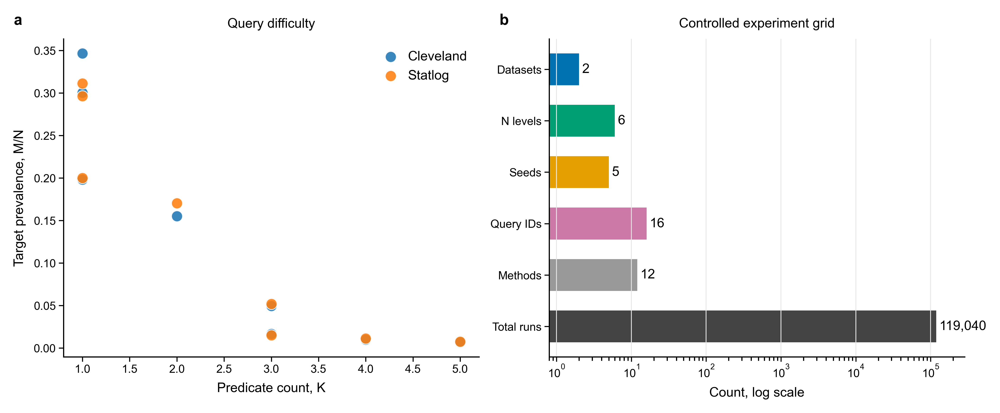
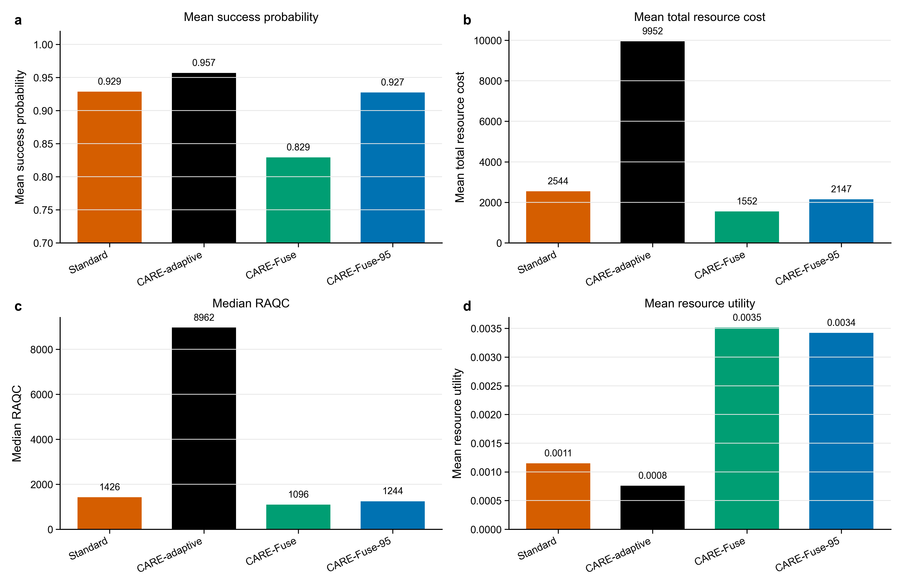
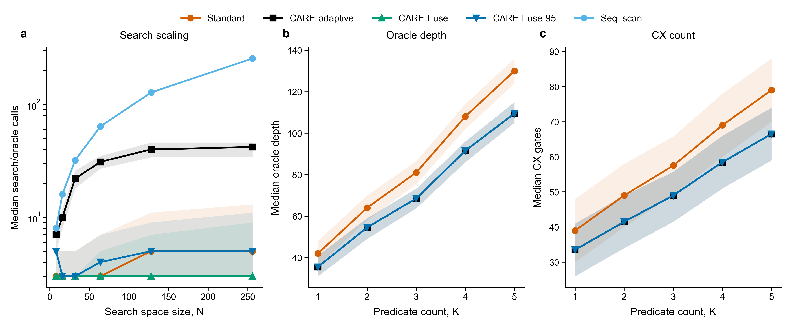
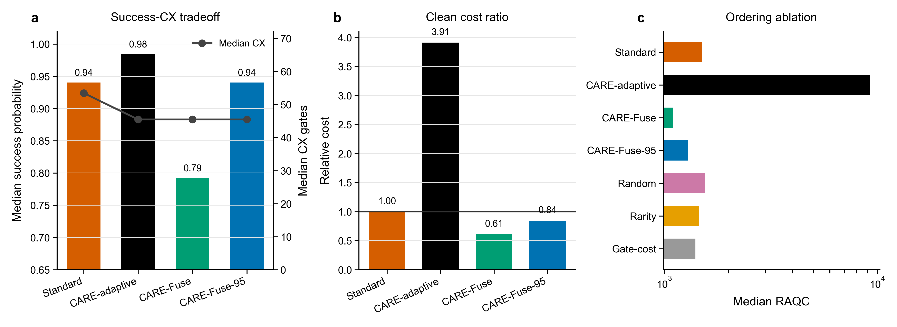
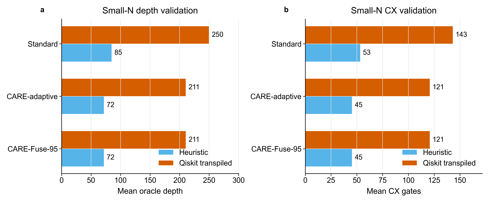

# CARE-QSearch

CARE-QSearch is a reproducible applied quantum-computing experiment for resource-aware clinical relational retrieval. The task is not disease classification. Each patient row is treated as a database record, and each query is a conjunction of clinical predicates over heart-disease variables.

The main idea is to make Grover-style relational search more resource-aware. Standard Grover search uses a fixed predicate oracle and an iteration count chosen for success. CARE-QSearch reorders predicates using selectivity and estimated gate cost. CARE-Fuse-95 then chooses a lower-cost Grover iteration count while keeping predicted success at least 95% of the standard Grover target.

## Main Result

The strongest supported claim is:

> CARE-QSearch improves or maintains retrieval success and reduces oracle-level depth/CX. CARE-Fuse-95 gives the best resource-success trade-off by preserving success close to standard Grover while reducing total resource cost in most paired runs.

Important caution:

> CARE does not reduce mean RAQC. RAQC has extreme outliers when success probability is very small, so RAQC should be reported with robust paired medians, not as a lower mean cost claim.

Key values from the final run:

| Comparison | Result |
|---|---:|
| CARE-QSearch-adaptive success vs standard Grover | `+0.0382` |
| CARE oracle depth vs standard Grover | `-11.33` |
| CARE CX count vs standard Grover | `-8.04` |
| CARE-Fuse-95 success vs standard Grover | `+0.0058` |
| CARE-Fuse-95 total resource cost vs standard Grover | `-288.22` |
| CARE-Fuse-95 total-cost paired win rate | `95.38%` |
| CARE-Fuse-95 success-retention paired rate | `98.64%` |
| CARE-Fuse-95 paired median RAQC difference | `-160.79` |
| Qiskit small-N validation cases | `96` |

## Main Plots

### Study Design



This plot shows the complete experiment flow: public clinical datasets, query generation, quantum retrieval methods, classical baselines, resource metrics, statistical tests, and Qiskit validation.

### Clean Performance



This plot compares the main methods under clean conditions. CARE-QSearch-adaptive gives the highest success, while CARE-Fuse-95 keeps success close to standard Grover with lower resource cost.

### Scaling and Oracle Cost



This plot separates scaling behaviour from oracle-resource behaviour. CARE ordering reduces oracle depth and CX count relative to standard Grover.

### Resource Trade-Off



This plot shows why the balanced claim uses CARE-Fuse-95. CARE-Fuse lowers cost more aggressively but gives lower success. CARE-Fuse-95 keeps success near standard Grover and improves total resource cost.

### Qiskit Validation



This plot shows the small-N Qiskit sanity check. Heuristic estimates understate absolute transpiled depth/CX, but the CARE-versus-standard resource-reduction trend is preserved.

## Datasets

Two UCI heart-disease datasets are used, but the data files are not committed to this repository:

| Dataset | Records | Features | Missing values |
|---|---:|---:|---:|
| Cleveland | 303 | 13 | 6 |
| Statlog | 270 | 13 | 0 |

Official dataset pages:

- Cleveland source: [UCI Heart Disease](https://archive.ics.uci.edu/dataset/45/heart+disease)
- Statlog source: [UCI Statlog Heart](https://archive-beta.ics.uci.edu/dataset/145/statlog%2Bheart)

Clinical variables used:

`age`, `sex`, `cp`, `trestbps`, `chol`, `fbs`, `restecg`, `thalach`, `exang`, `oldpeak`, `slope`, `ca`, `thal`

Download the datasets before running:

```bash
curl -L -o heart-disease.zip "https://archive.ics.uci.edu/static/public/45/heart+disease.zip"
mkdir -p "heart+disease"
unzip -o heart-disease.zip -d "heart+disease"

curl -L -o statlog-heart.zip "https://archive.ics.uci.edu/static/public/145/statlog+heart.zip"
mkdir -p "statlog+heart"
unzip -o statlog-heart.zip -d "statlog+heart"
```

Expected local files after download:

```text
heart+disease/processed.cleveland.data
statlog+heart/heart.dat
```

## Repository Structure

```text
.
├── src/                           # Experiment implementation
├── output/
│   ├── figures/png/               # Main PNG figures only
│   ├── tables/excel/              # Excel result tables
│   ├── manuscript_summary/         # Key numbers and claim support
│   ├── qiskit_validation/          # Small-N Qiskit sanity check
│   ├── queries/                    # Generated and manual query definitions
│   ├── reproducibility/            # Seeds, environment, and subsets
│   └── statistical_tests/          # Paired statistical tests
├── run_all.py                     # Main entry point
├── requirements.txt               # Python dependencies
└── RUN_COMMANDS.md                # Exact commands for reruns
```

The full raw result CSV is not committed because it is large and can be regenerated.
Dataset folders are also not committed. Use the download commands above.

## Install

```bash
python3 -m pip install -r requirements.txt
```

Qiskit/Aer is optional for the main experiment. The default full run uses transparent heuristic resource estimates. Qiskit validation is available as a separate small-N sanity check.

## Run

Smoke test:

```bash
MPLCONFIGDIR=/private/tmp/mplconfig python3 run_all.py --mode smoke --force
```

Full experiment, replacing old generated outputs:

```bash
MPLCONFIGDIR=/private/tmp/mplconfig python3 run_all.py --mode full --force
```

Regenerate tables and summaries from existing raw results:

```bash
MPLCONFIGDIR=/private/tmp/mplconfig python3 run_all.py --mode analysis-only --force
```

Regenerate plots from existing raw results:

```bash
MPLCONFIGDIR=/private/tmp/mplconfig python3 run_all.py --mode plots-only --force
```

Small-N Qiskit validation:

```bash
MPLCONFIGDIR=/private/tmp/mplconfig python3 run_all.py --mode qiskit-validation
```

## Outputs

Important generated artifacts:

| Path | Content |
|---|---|
| `output/figures/png/` | Main paper-ready PNG plots |
| `output/tables/excel/all_tables.xlsx` | Combined Excel workbook |
| `output/tables/excel/table*.xlsx` | Individual result tables |
| `output/manuscript_summary/key_numbers.txt` | Main numeric claims |
| `output/manuscript_summary/results_summary.md` | Publishable-status summary |
| `output/qiskit_validation/qiskit_smallN_validation.xlsx` | Qiskit sanity-check workbook |
| `output/statistical_tests/paired_tests.csv` | Paired statistical tests |

